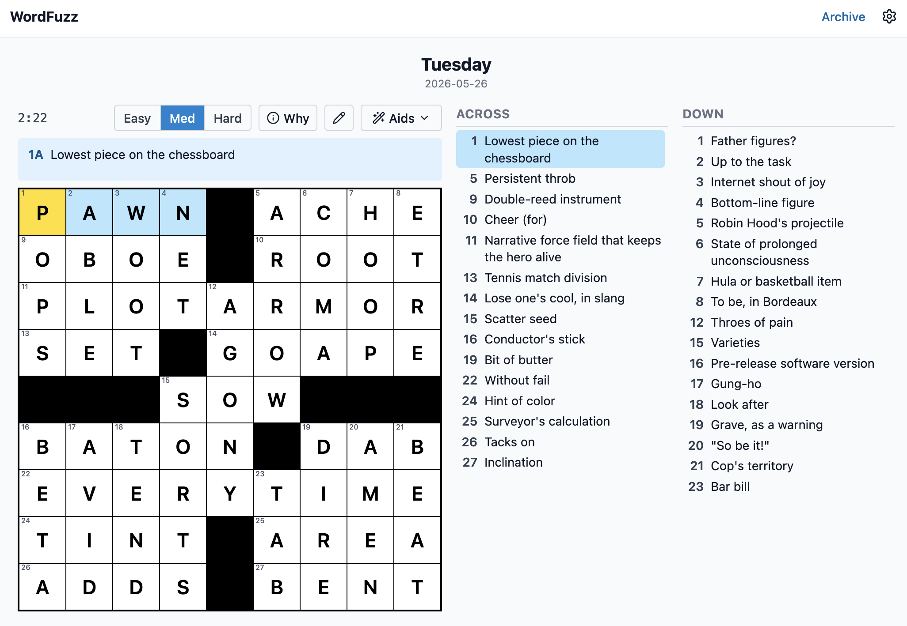

# xword-pipeline

[](https://github.com/ekorbia/xword-pipeline/actions/workflows/ci.yml)
[](./LICENSE)

An end-to-end pipeline for generating **dense, NYT-style crossword puzzles**:
a Rust constraint-solver fill engine, multi-tier AI clue writing (Easy →
Expert), optional per-answer explanations, and an adversarial AI editorial
pass that gates publication.

```
  theme-idea ─▶  fill-engine  ─▶  clue  ─▶  qa  ⇄  clue --revise
  (optional)     (Rust: grid     (Claude:   (Claude:   (Claude: fix
   theme sets     generation +    write      review)    flagged clues)
                  scored fill)    clues)
```

> **See it in action:** [**wordfuzz.com**](https://wordfuzz.com) serves
> puzzles generated by this pipeline — including the tier picker and post-solve
> explanations described below.
>
> **Play puzzles you generate yourself:** drop your pipeline output JSON at
> [**wordfuzz.com/test**](https://wordfuzz.com/test) to play it in the browser.
> Files never leave your machine — the page is a client-side renderer.

<p align="center">
  
</p>

Two components live side by side under this repo:

```
xword-pipeline/
├── run-pipeline.sh      # one command: generate → clue → qa
├── fill-engine/         # Rust: dense grid generation + quality-scored fill
├── clue-writer/         # TypeScript: Claude clue writing, QA, theme ideation
└── out/                 # ALL generated JSON (gitignored)
    ├── libraries/       #   grid-library.json / theme-library.json   (fill-engine)
    ├── puzzles/         #   *.clued.json, *.qa.json, *.revised.json   (clue/qa/revise)
    └── themes/          #   theme-idea output
```

The fill engine is pure Rust and runs offline (free). The clue/QA/theme steps
call Claude and need an API key. Each step uses the cheapest model that holds
its quality bar (see `clue-writer/src/models.ts`): **Opus 4.7** for clue
writing and QA, **Opus 4.8** for theme ideation, **Haiku 4.5** for the
post-solve explainer.

---

## One-time setup

```bash
# 1. Build the Rust engine
(cd fill-engine && cargo build --release)

# 2. Install the Claude layer
(cd clue-writer && npm install)

# 3. Set your Anthropic API key (see clue-writer/README for how to get one)
export ANTHROPIC_API_KEY=sk-ant-...
```

---

## Quick start — the whole pipeline in one command

`run-pipeline.sh` runs **generate → clue → qa** and prints the QA verdict. All
output lands in `out/`. Run with **no arguments** (`./run-pipeline.sh`) to
enter an interactive wizard that walks you through size, tier mode, explainer,
and the quality levers — themeless puzzles only; themed runs use the flags
directly. (Fixing the findings QA reports is a separate manual step — see
[Fixing QA findings](#fixing-qa-findings).)

```bash
# Themeless (Fri/Sat-style) puzzle
./run-pipeline.sh --mode themeless --day Saturday

# Mini puzzles — small grids that are quick to fill & solve (great for testing)
./run-pipeline.sh --mode themeless --size 5  --day Easy     # 5×5 mini
./run-pipeline.sh --mode themeless --size 10 --day Medium   # 10×10 midi

# Themed (Mon–Thu-style) puzzle — supply the theme answers
./run-pipeline.sh --mode themed \
  --themes WAITINGFORGODOT,ROCKETSCIENCE,TROMBONE --day Wednesday
```

The grid step is free; the script pauses before the paid Claude steps if
`ANTHROPIC_API_KEY` isn't set (your library is still generated). On completion it
prints the three artifact paths and the verdict.

### Script flags

| Flag | Default | Notes |
|------|---------|-------|
| `--mode themeless\|themed` | `themeless` | Themed requires `--themes` |
| `--size N` | `15` | **Themeless only.** Grid dimension — e.g. `5` or `10` for minis. Themed grids are 15×15 for now |
| `--themes A,B,C` | — | Theme answers (A–Z, no spaces). 1–4 answers; each 3–15 letters but **never exactly 12** (a 12-letter answer can't be placed as a single across in a 15-wide grid). **7–11 letters fill best** — a 13–15 letter answer and its full-width mirror slot cross most of the grid, so use at most one per set |
| `--blocks N` | ~16% of area ± ~10% / 44 ± ~10% | Black squares. Default is ~16% of the grid area with a seeded ±10% jitter (15→32-40, 10→14-18, 5→3-5); themed grids default to 44 with the same jitter shape and a 42-block floor. Pass an explicit N to disable jitter. Reproducible via `--seed` |
| `--day DAY` | Saturday / Wednesday | Clue difficulty. Accepts a day (Monday…Saturday) **or** a friendly word: `Easy`=Mon, `Medium`=Wed, `Tricky`=Thu, `Hard`=Fri, `Expert`=Sat |
| `--grid N` | `0` | Which library grid to clue (`0` = highest quality) |
| `--keep-mean F` | `78` / `68` themed | **Quality floor.** Keep only grids whose mean answer-score ≥ F. Themed fills are far more constrained, so themed mode auto-relaxes to 68 unless you override |
| `--max-iffy N` | `0` / `12` themed | **The key fill-quality lever** — see below. Themed mode auto-relaxes to 12 |
| `--candidates N` | `200` | How many random grids to generate & screen |
| `--time SECS` | `2` / `5` themed | Per-grid fill budget. Themed grids need the deeper search |
| `--top N` | `20` | How many of the best grids to keep in the library |
| `--explain-model <id>` | `claude-haiku-4-5` | Model for the post-solve explainer (used only with `--explain`). Pass `claude-opus-4-7` to restore the previous, higher-cost behavior |
| `--name ID` | `<mode>-grid<GRID>` | Output-file prefix override. Use unique names across runs to prevent file collisions (the batch orchestrator does this automatically; specify manually only for ad-hoc multi-puzzle runs) |
| `--date YYYY-MM-DD` | — | If `--name` is not given, auto-derives `--name puzzle-<DATE>`. Also appended to the suggested `import-puzzle` command so the player slots the puzzle into the right manifest date |

### The quality levers (`--max-iffy`, `--keep-mean`)

Fill quality is the single biggest driver of how good the puzzle — and therefore
the clues and the QA verdict — turns out. Two flags control it:

- **`--max-iffy N`** — an "iffy" entry is one scoring **below 50** on the wordlist's
  1–100 scale (50 = a normal, fair answer; below 50 is questionable crosswordese,
  obscure abbreviations, awkward partials). `--max-iffy N` keeps only grids with
  **at most N** such entries.
  - **`--max-iffy 0` is the recommended default and the most important flag here.**
    It keeps only grids where *every* answer scores ≥ 50, which eliminates almost
    all `fill`-category QA findings **at the source** — before a single clue is
    written. If your QA reports keep flagging weak fill, this is the fix.
  - Trade-off: stricter gates reject more grids, so pair a strict `--max-iffy`
    with a higher `--candidates` (e.g. `--max-iffy 0 --candidates 400`) so enough
    grids survive. Themed grids are far harder to fill cleanly, so **themed mode
    automatically relaxes to `--max-iffy 12 --keep-mean 68 --time 5`** unless you
    pass explicit values.
- **`--keep-mean F`** — raises the *average* answer quality (not just the floor).
  78–80 yields polished, lively grids; lower it toward 70 if too few grids pass.

Independent of both gates, the screeners also reject any fill containing
**root-duplicate answers** — shared stems (TEN/TENTH, EVEN/UNEVENLY), one
answer inside another (HOME/HOMERUN), or a prominent word embedded in two
answers (BALL in BASEBALL/SEVEBALLESTEROS) — historically the most common
high-severity QA finding. The offending pairs are printed when rejections
happen. Theme-vs-theme pairs are exempt, since theme sets often share a word
deliberately. The clue writer additionally runs a
deterministic answer-in-clue check after writing (no grid answer may appear in
any clue) and auto-revises just the violating clues before the QA step.

```bash
# Strict: only flawless-fill grids (screen more candidates to compensate)
./run-pipeline.sh --mode themeless --max-iffy 0 --keep-mean 80 --candidates 400
```

### Blocklist — banning specific words

Some junk entries are **mis-scored high** in the wordlist (e.g. `TOONIEBAR` is
scored 100), so no `--keep-mean`/`--max-iffy` setting can keep them out. For
those, edit **`fill-engine/data/blocklist.txt`** — one word per line; the engine
excludes them from every fill regardless of score:

```
# fill-engine/data/blocklist.txt
TOONIEBAR
EATSLIP
```

Case, spaces, and punctuation are ignored (`EAT SLIP` == `EATSLIP`). The engine
prints `blocklist: excluding N word(s)` on load. **Grow this list over time from
your QA findings** — it's the cheapest way to permanently retire words you never
want to see. Blocking a handful of words has no measurable effect on fill rate.

### Supplemental wordlist — adding new entries

The Crossword Nexus wordlist is comprehensive but lags on very recent culture
and tech (WORDLE, CHATGPT, etc. are not in the upstream as of mid-2026).
Add them in **`fill-engine/data/supplemental.txt`**, one per line, same
`WORD;SCORE` format as the main dict:

```
# fill-engine/data/supplemental.txt
CHATGPT;75
WORDLE;75
BLOCKCHAIN;70
DOOMSCROLL;65
```

The engine prepends this file to the main wordlist at load time, so entries
here are placeable just like upstream entries. On startup the engine prints
`supplemental: N entries loaded` so you can verify the file is being read.

Conventions:

- Same letter-only normalization as the main dict (`E.T.` → `ET`); 3-15 letters.
- Score 0-100. Roughly: 75+ = NYT-grade lively; 60-70 = real but slightly
  niche; 50-59 = specific brand/jargon (placeable, flag with caution); below
  50 acts as iffy fill and gets filtered out by `--max-iffy 0`.
- Entries here **override** main-dict duplicates, so this file doubles as a
  per-entry score-override mechanism for upstream entries you think were
  mis-scored.
- **Blocklisted entries are still excluded**, regardless of which file added
  them — `blocklist.txt` is the strongest signal.

The repository ships with ~90 seeded entries spanning recent tech, pharma,
crypto, sports (NFL/NBA/WNBA/tennis/baseball/soccer), films (2022-2025), TV
shows, music, pop-culture figures, politics, and online slang — including
many "full name" entries (TRAVISKELCE, PATRICKMAHOMES, ZENDAYA, etc.) that
are well-suited as theme answers. A small "score overrides" section at the
end lifts a handful of upstream entries (KENDRICKLAMAR, TAYLORSWIFT, etc.)
to scores that match their actual cultural prominence. Grow it as you spot
missing answers in your QA findings.

---

## Fixing QA findings

The script stops at QA. If the verdict isn't `ready`, fixing it depends on the
**category** of each finding — and the categories live at **two different layers**:

| QA category | Layer | Fix |
|---|---|---|
| `fill` | **Grid** — the answer itself is weak | Different grid or stricter gates |
| `duplicate` (same answer twice / near-dup) | **Grid** | Different grid |
| `duplicate` (answer appears in a clue) | **Clue** | `clue --revise` |
| `style`, `clue-accuracy`, `difficulty` | **Clue** | `clue --revise` |

**Fix grid-layer findings first** — a new grid changes the answers, which throws
away any clue work.

### Grid-level fixes (`fill`, duplicate-answers)

```bash
# Try the next-best grid in the same library, then re-clue + re-QA
./run-pipeline.sh --mode themeless --grid 1 --day Saturday

# …or regenerate the library so weak fill can't get in (then --grid 0)
./run-pipeline.sh --mode themeless --max-iffy 0 --keep-mean 80 --candidates 400
```

### Clue-level fixes (`style`, duplicate-in-clue, accuracy, difficulty)

Feed the QA report back; only the flagged clues are rewritten. Grid-level
findings it can't fix are reported as **unresolved** (go back to the step above).

```bash
cd clue-writer
npm run clue -- ../out/puzzles/themeless-grid0.clued.json \
               --revise ../out/puzzles/themeless-grid0.qa.json \
               --out ../out/puzzles/themeless-grid0.revised.json
npm run qa  -- ../out/puzzles/themeless-grid0.revised.json
```

Repeat **revise → qa** until the verdict is `ready` / `minor-revisions`.

---

## Theme ideation (optional, front of pipeline)

Stuck for a theme? Have Claude brainstorm sets that obey the grid constraints; it
prints ready-to-run commands you can hand to the themed pipeline.

```bash
cd clue-writer
npm run theme-idea -- --topic "hidden body parts" --count 3 --answers 3
# → pick a set, then:
cd .. && ./run-pipeline.sh --mode themed --themes <A>,<B>,<C>
```

---

## Multi-difficulty puzzles & post-solve explanations

The player can take a single puzzle that carries **up to four clue sets**
(Easy / Medium / Hard / Expert) plus an optional **one-line explanation** per
answer, so the solver picks a difficulty and gets a short "why this fits" note
after solving. Each tier is day-calibrated:

| Tier   | Day calibration |
|--------|------------------|
| easy   | Monday           |
| medium | Wednesday        |
| hard   | Friday           |
| expert | Saturday         |

`run-pipeline.sh --tiers` does the whole thing in one command. **In multi-tier
mode, QA reviews each tier independently** against its own day rubric, so a
"too easy for Saturday" finding from QA on the expert tier is meaningful (it
sees expert clues calibrated to Saturday). Per-tier outputs land at
`out/puzzles/${name}.qa.${tier}.json`.

```bash
# All four tiers + post-solve explanations, end-to-end:
./run-pipeline.sh --mode themeless --tiers easy,medium,hard,expert --explain

# Drop --tiers and use --day for legacy single-tier puzzles.
```

The script prints a ready-to-paste `import-puzzle` command at the end. The
player's `import-puzzle` derives the manifest `difficulty` label from the
**tier ceiling** of the bundle (easy-only ⇒ "Easy", up through expert ⇒
"Expert"), so the badge truthfully reflects the hardest content available.

> Want to see the tier picker and explanation reveal without standing up the
> player? Drop your `*.clued.*.json` files (and optional `*.explained.json`)
> onto [wordfuzz.com/test](https://wordfuzz.com/test) — it's the same engine
> that powers the daily puzzles, running entirely in your browser.

Cost: ~N× clue + N× QA per puzzle on Opus 4.7, + 1× explain on Haiku, where N is the
number of tiers. Backward compatible — single-tier puzzles imported the old
positional way (`<clued.json>`) still work.

## Generating a batch of puzzles in one command

`generate-batch.sh` wraps `run-pipeline.sh` to produce N dated puzzles in
one orchestrated run, with unique filenames per date. Common use is a week
of daily content (hence the example below), but the pattern length is
arbitrary — anywhere from one puzzle to dozens.

```bash
# 7 puzzles: three 10×10 (Mon-Wed), four 15×15 (Thu-Sun).
./generate-batch.sh \
  --start 2026-06-09 \
  --pattern 10,10,10,15,15,15,15 \
  --tiers easy,medium,hard
```

Each puzzle gets `--name puzzle-<DATE>` and `--date <DATE>` automatically, so
the output files are unique and downstream import knows which manifest day to
write. Number of puzzles is implicit from `--pattern`'s length.

**Defaults differ from `run-pipeline.sh`** for batch-friendly behavior:

| Flag | Batch default | Single-puzzle default | Why |
|------|---------------|------------------------|------|
| QA | **off** (`--qa` to enable) | on (`--no-qa` to skip) | Fill engine already guarantees solvability; QA findings aren't acted on in batch anyway |
| Explain | **on** (`--no-explain` to skip) | off (`--explain` to enable) | Per-puzzle explanations are typically wanted for daily content |
| Failure | continue (`--abort-on-fail` to bail) | exit on first failure | One bad puzzle shouldn't kill the rest of the batch |
| Candidates | **300** (`--candidates N` to override) | 200 | Slightly deeper per-puzzle library (more clean grids kept). Local CPU cost only; no API impact. Adds ~10-15 min to a week-sized batch. |

All other quality levers (`--max-iffy`, `--keep-mean`, `--candidates`,
`--explain-model`) pass through to each per-puzzle invocation uniformly.

The fill-engine seed defaults to current epoch (`$(date +%s)`) — each
`generate-batch.sh` invocation produces a different set of puzzles.
Each puzzle within the batch uses `BASE_SEED + index` for a distinct seed
even when generation finishes quickly. To reproduce a specific batch, pass
`--seed N` matching the `Base seed` value printed in the run's summary
block. The same default applies to `run-pipeline.sh` directly — each
invocation varies; pass `--seed N` to fix it.

At the end you get a status table plus an executable import script:

```
================= batch complete =================
  ✓  2026-06-09 (10x10)   ok
  ✓  2026-06-10 (10x10)   ok
  ✓  2026-06-11 (10x10)   ok
  ✓  2026-06-12 (15x15)   ok
  ✗  2026-06-13 (15x15)   FAILED (fail:rc=1)
  ✓  2026-06-14 (15x15)   ok
  ✓  2026-06-15 (15x15)   ok

  Successful : 6/7
  Wall-clock : 14m 32s
=================================================

  Or import all in one shot:
    bash <repo>/out/imports-2026-06-09.sh
```

The generated `out/imports-<start>.sh` runs `npm run import-puzzle` for
each successful puzzle in sequence, with dates and tier flags pre-filled.
Failed puzzles are skipped in the import block.

## Running the tools individually

The script is just orchestration. Each tool is documented in its own README and
can be run directly:

- **fill-engine** (`library`, `theme`, `screen`, `xfill`): see
  [fill-engine/README.md](fill-engine/README.md). Run from `fill-engine/`.
- **clue-writer** (`clue`, `qa`, `theme-idea`, `clue --revise`): see
  [clue-writer/README.md](clue-writer/README.md). Run from `clue-writer/`.
  Default outputs go to `../out/…`; every command supports `--dry-run` to print
  its Claude prompt with no API call.

---

## Cost / notes

| Step | API? | Cost |
|---|---|---|
| `fill-engine` (grid generation) | No | free, seconds |
| `clue` / `qa` / `revise` | Yes | a few cents each (Opus 4.7) |
| `theme-idea` | Yes | a few cents each (Opus 4.8) |
| `explain` | Yes | ~1/5 of the above (Haiku 4.5 by default; override with `--explain-model`) |

- **Themeless fills cleaner than themed.** Themed grids carry the theme answers
  plus equal-length mirror slots, so they're harder to fill — the pipeline
  auto-relaxes themed gates to `--keep-mean 68 --max-iffy 12 --time 5`. Theme
  answers of 7–11 letters fill far better than 13–15.
- Every Claude command has a `--dry-run` flag to preview the prompt for free.

---

## Contributing

PRs welcome — see [CONTRIBUTING.md](./CONTRIBUTING.md) for setup, the test/CI
flow, and conventions for fill-engine vs. clue-writer changes.

## License

This project is licensed under the [MIT License](./LICENSE).

The bundled wordlist at `fill-engine/data/xwordlist.dict` is distributed under
its own MIT license — see [`fill-engine/data/LICENSE-wordlist.txt`](./fill-engine/data/LICENSE-wordlist.txt)
for the original copyright and source attribution.
